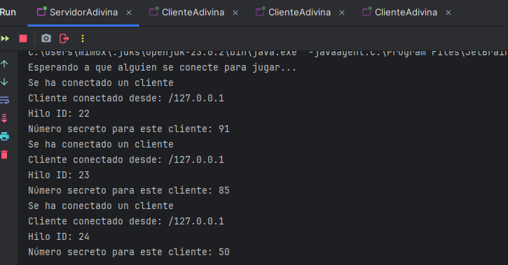
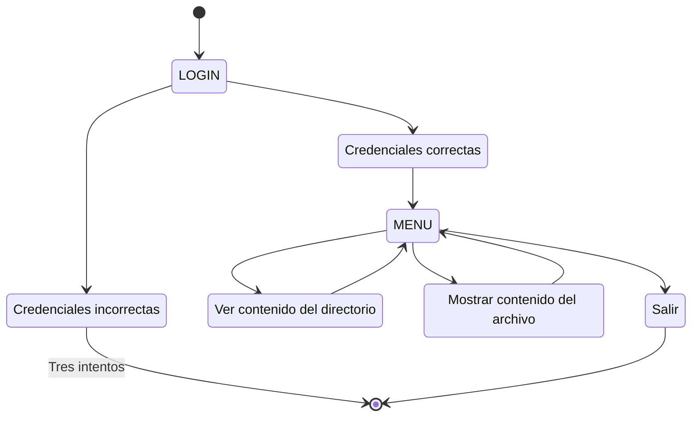
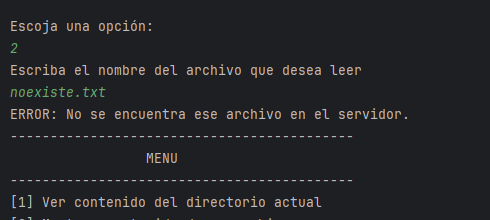

# Tarea PSP04 - Trabajo concurrente en servidor/cliente
## Índice


## Actividad 4.1
Se pide modificar el ejercicio 3.1 (PSP03) para trabajar de forma concurrente con varios clientes.

La interpretación que se hace del enunciado implica:
- El servidor no se bloquea cuando un cliente se conecta
- Crea un hilo por cada cliente
- Puede atender a diferentes clientes a la vez

En el ejercicio 3.1, el funcionamiento era sencillo, el cliente se conectaba al servidor e iba mandando números del 
1 al 100 que debían coincidir con el elegido por el servidor.

Modificaremos el main de manera que varios clientes estén de forma simultánea y que cada cliente tenga un número 
secreto mediante la creación de un `HiloAdivina.java` que es el que maneja esa concurrencia.

El cambio principal es la clase HiloAdivina donde cada hilo gestiona a un cliente de forma separada y se lanza por 
el servidor cuando se conecta.

### `ServidorAdivina.java`
```java
public class ServidorAdivina {
    public static void main(String[] args) {
        //Se utiliza try-with-resources porque así el servidor se cierra porque ocn el while no lo hace
        try (ServerSocket socketServidor = new ServerSocket(2000)){
            System.out.println("Esperando a que alguien se conecte para jugar...");

            while(true){ //El servidor nunca se apaga
                Socket miCliente = socketServidor.accept(); // Espera clientes
                System.out.println("Se ha conectado un cliente");
                System.out.println("Cliente conectado desde: " + miCliente.getInetAddress());
                new HiloAdivina(miCliente).start(); // cada cliente está en un hilo diferente
            }
        } catch (Exception e) {
            System.out.println("Ha habido un fallo en el servidor: " + e.getMessage());
        }
    }
}
```
En la clase auxiliar `HiloAdivina.java` se implementa la lógica de la conversación con el cliente que ya estaba en 
el ejercicio anterior.

Al iniciar el servidor y conectarse tres clientes de forma simultánea, vemos que cada uno funciona de forma 
independiente:


### Dificultades encontradas 
Durante el desarrollo de esta actividad se encontró un problema en el servidor porque se intentó manejar el 
`ServerSocket` sin `try-with-resources `y dejaba el puerto ocupado por lo que el servidor fallaba. 


## Actividad 4.2

En este ejercicio se implementaba el mismo patrón que en el anterior, siguiendo la misma linea con la clase  
`HiloFicheros.java`, ya que la peculiaridad de este ejercicio frente al anterior era precisamente la lectura de los 
ficheros.

La clase del servidor es idéntica a la de la actividad 4.1, y se maneja el control de excepciones en el 
`HiloFicheros` con un try-catch:

### `HiloFicheros.java`
```java
public class HiloFicheros extends Thread {
    private final Socket miCliente;

    // Constructor
    HiloFicheros(Socket miCliente) {
        this.miCliente = miCliente;
    }

    public void run() {
        try {
            BufferedReader lector = new BufferedReader(new InputStreamReader(miCliente.getInputStream()));
            PrintWriter escritor = new PrintWriter(miCliente.getOutputStream(), true);

            // Leemos el nombre del archivo que quiere el cliente
            String nombreArchivo = lector.readLine();
            File f = new File(nombreArchivo);

            if (f.exists() && f.isFile()) {
                // Si el archivo está, lo leemos y enviamos línea a línea
                BufferedReader leerArchivo = new BufferedReader(new FileReader(f));
                String linea;
                while ((linea = leerArchivo.readLine()) != null) {
                    escritor.println(linea);
                }
                leerArchivo.close();
            } else {
                // Si no existe, mandamos el mensaje de error directamente
                escritor.println("ERROR: No se encuentra ese archivo en el servidor.");
            }
        }catch (IOException e){
            System.out.println("El cliente se ha desconectado.");
        } catch (Exception e) {
            System.out.println("Error en el hilo: " + e.getMessage());
        } finally {
            try{
                miCliente.close();
            }catch(IOException e){
                System.out.println("Error al cerrar el socket");
            }
        }
    }
}
```
Se tuvo que añadir un finally con el cierre del servidor porque lo que ocurría es el socket no se cerraba si saltaba 
una excepción antes del `close()`, quedando el hilo abierto.

## Actividad 4.3

En la actividad se usa de base el código del ejercicio anterior con algunas modificaciones respecto a él para 
manejar también un inicio de sesión.

El funcionamiento es sencillo, mediante una palabra "Clave" que recibe el cliente y el servidor, se va pasando por 
las diferentes etapas de la aplicación. Son los estados `LOGIN`, `MENU` y `SALIR`.

Para poder iniciar el desarrollo, se procede al diseño del diagrama que ilustra de forma más visual este "cambio de 
fases":

### Diagrama de estados 


### Funcionamiento
En el inicio se intentó hacer la validación de las credenciales en el cliente, pero claro, si las credenciales se 
almacenaban en el código del cliente, por un tema de seguridad, no tendría sentido porque cada cliente, tuviese o no 
las credenciales, podrían ser accesibles desde ellos mismos, por lo tanto la lógica se implementa dentro del mismo 
`HiloServidor.java`. 

La validación de credenciales se realiza en el servidor y responde `"OK"` o `"FAIL"`. Ambos gestionan con contadores 
y bucles el máximo establecido de tres intentos antes de terminar el proceso.

Una vez autenticado, el cliente accede al menú donde se le permite realizar las tres opciones principales: Ver el 
contenido de un directorio, leer un archivo o salir. 

Para delimitar el fin de cada respuesta se usa el delimitador `"FIN"`, de manera que el cliente sigue leyendo los 
mensajes del servidor (que manda la información de las peticiones) hasta que el cliente recibe ese mensaje de `"FIN"`.

### `HiloServidor.java`

Para controlar la lógica, se implementa en el método `run()`
```java
public void run() {
        final int MAX_INTENTOS = 3;
        try {
            BufferedReader lector = new BufferedReader(new InputStreamReader(miCliente.getInputStream()));
            PrintWriter escritor = new PrintWriter(miCliente.getOutputStream(), true);

            //login
            boolean autenticado = false;
            int intentos = 0;

            while (!autenticado && intentos < MAX_INTENTOS) {
                autenticado = login(lector, escritor, miCliente);
                intentos++;
            }

            //Si el login es correcto, comienza el menú
            if (autenticado) {
                menu(lector, escritor);
            }

        } catch (IOException e) {
            System.out.println("El cliente se ha desconectado.");
        } catch (Exception e) {
            System.out.println("Error en el hilo: " + e.getMessage());
        } finally {
            try {
                miCliente.close();
            } catch (IOException e) {
                System.out.println("Error al cerrar el socket");
            }
        }
    }
```
El hilo se conforma de una función `login(BufferedReader bf, PrintWriter pw, Socket cliente)` que devuelve un 
boolean si se completa la autenticación o no.
```java
 public boolean login(BufferedReader bf, PrintWriter pw, Socket cliente) {
        final String USER = "admin";
        final String PASS = "1234";

        String client_user;
        String client_pass;

        try {
            client_user = bf.readLine();
            client_pass = bf.readLine();
        } catch (IOException e) {
            throw new RuntimeException(e);
        }

        if (client_user.equals(USER) && client_pass.equals(PASS)) {
            System.out.println("Autenticación correcta para el cliente " + cliente.getInetAddress());
            pw.println("OK");
            return true;
        } else {
            pw.println("FAIL");
            return false;
        }
    }
```

El menú es controlado mediante un switch-case:
```java
private void menu(BufferedReader lector, PrintWriter escritor) throws IOException {
        String opcion;

        while (true) {//Siempre encendido
            opcion = lector.readLine(); //Lee lo que le envia el cliente

            switch (opcion) {
                case "1":
                    listaDirectorio(escritor);
                    break;
                case "2":
                    String nomArchivo = lector.readLine(); //Leemos lo que dice el cliente
                    muestraFichero(nomArchivo, escritor);
                    break;
                case "3":
                    // salir
                    return;
            }
        }
    }
```
Como novedad frente a la actividad PSP03 se implementa un método que muestra por pantalla los archivos del 
directorio del servidor: 
```java
public void listaDirectorio(PrintWriter pw) {
        try {
            File directorio = new File(".");
            String[] lista = directorio.list(); //Llena la lista con lo que hay en la carpeta

            if (lista == null) {
                pw.println("El directorio está vacío.");
                pw.println();
                pw.println("FIN");
            } else {
                for (String elemento : lista) {
                    pw.println(elemento);
                }
                pw.println();
                pw.println("FIN");
            }
        } catch (Exception e) {
            System.out.println("Error:" + e.getMessage());
        }
    }
```
El método para leer un archivo y mostrarlo al cliente se ha reutilizado del ejercicio 4.2 (`muestraFichero(String nombre, PrintWriter escritor)`)

El funcionamiento al probarlo es el siguiente:


Para leer un archivo se usa un fichero de texto en el directorio raíz del proyecto `prueba.txt` con el siguiente 
contenido:
```text
----------------------------

Este es un archivo de prueba
----------------------------

El servidor lee línea a línea el contenido del fichero
y manda de forma secuencial las líneas al cliente, que imprime en su terminal

Es un ejemplo de como funciona la comunicación entre un servidor y un terminal que se conecta a él

Mediante mensajes de control como "MENU", "LOGIN" o "FIN" podemos saber en que "fase" de la comunicación estamos

Tarea PSP04
```

Al probarlo se ve como lo imprime correctamente:


También maneja si el archivo no existe:



## Conclusión
Con estas tres actividades se ha construido un servidor que puede atender a varios clientes con los hilos. Además, se 
ha comprobado la importancia de cerrar bien los sockets y los puertos, y la utilización de "claves" para poder 
controlar el flujo de la comunicación entre el cliente y el servidor.

Los errores que se han ido encontrando son, por ejemplo el problema al usar `nextInt()` al enviar y recibir mensajes,
si se quería usarlo, como se intentó al inicio, al pulsar la tecla enter se queda en el buffer y lo recoge el 
siguiente `nextLine()` por lo que devolvía una cadena vacía. Para eso se usó `Integer.parseInt(sc.nextLine())`.

Este error ayudó a conocer mejor como funciona la lógica de la comunicación en red.